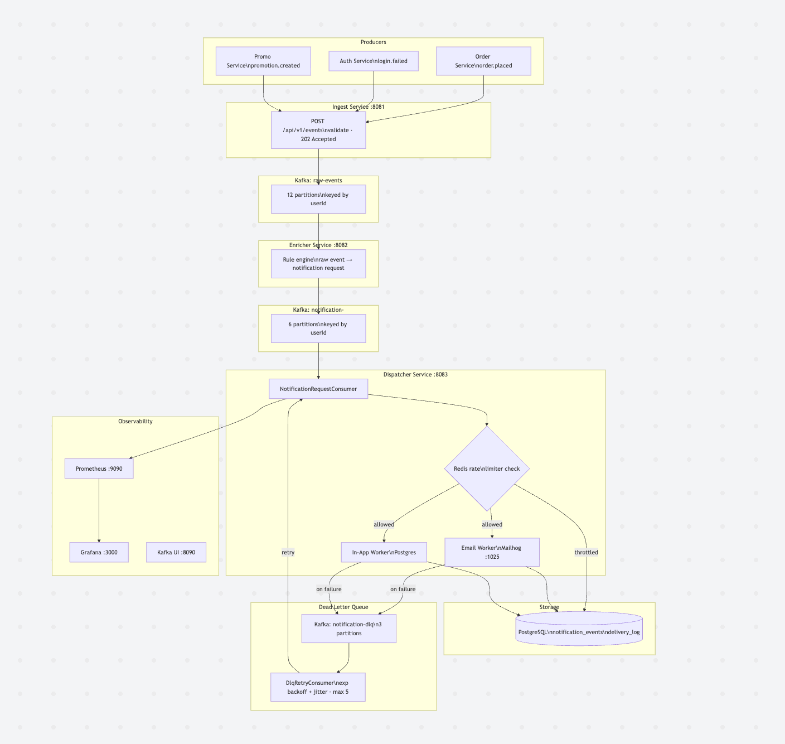
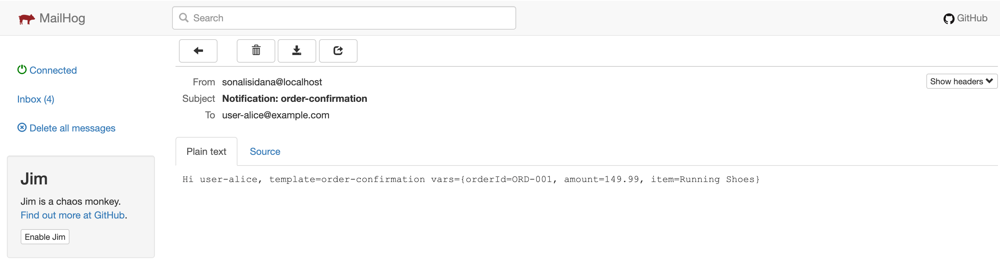
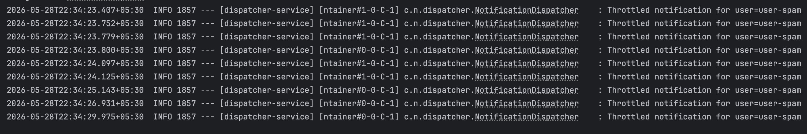
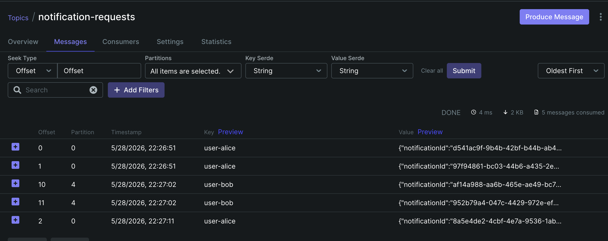
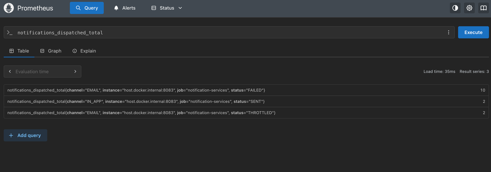
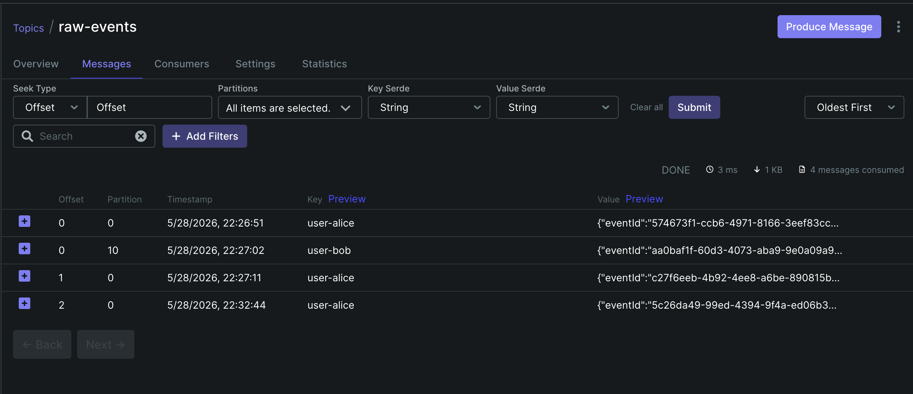

# Event-Driven Notification Service


A production-grade, distributed notification system built with Kafka, Redis, and Spring Boot to demonstrate distributed systems engineering.

## Table of Contents
- [Architecture](#architecture)
- [Key Design Decisions](#key-design-decisions)
- [Tech Stack](#tech-stack)
- [Local Setup](#local-setup)
- [Testing the System](#testing-the-system)
- [Supported Event Types](#supported-event-types)
- [Rate Limiting](#rate-limiting)
- [What I Would Add in Production](#what-i-would-add-in-production)

## Architecture


| Step | Component | What happens |
| --- | --- | --- |
| 1 | Ingest Service | REST event received, published to raw-events (keyed by userId) |
| 2 | Enricher Service | Rule engine maps event type to notification channels, publishes to notification-requests |
| 3 | Dispatcher Service | Rate limit check → fan-out to Email/In-App workers → DLQ on failure |

## Key Design Decisions
- Two Kafka topics separate ingestion from notification generation so each stage can scale, replay, and evolve independently. This keeps raw business events decoupled from downstream notification rules.
- A sliding window is a better fit than token bucket because it enforces a strict "5 notifications per 60 seconds" policy without burst leakage at window boundaries. Redis plus an atomic Lua script also keeps the decision race-free under concurrency.
- The system uses at-least-once delivery with application-level idempotency because it is simpler and more portable than Kafka exactly-once for a multi-sink workflow. That trade-off is practical when one notification may touch Kafka, Redis, SMTP, and PostgreSQL in the same path.
- Messages are partitioned by `userId` so events for the same user stay ordered end to end. That matters for consistent throttling, deterministic retries, and user-facing notification sequencing.
- Full jitter is applied to DLQ retry backoff to avoid synchronized retries when many failures happen at once. It reduces retry storms and smooths load on recovering dependencies.

## Tech Stack
| Component | Technology | Why |
| --- | --- | --- |
| Event streaming | Apache Kafka | Durable, replayable, partitioned by `userId` for ordering |
| Rate limiting | Redis + Lua script | Atomic sliding window, no TOCTOU race condition |
| Database | PostgreSQL 15 + Flyway | Audit log, delivery status, schema versioning |
| Email delivery | Mailhog (local SMTP) | Zero cloud dependency for local development |
| Metrics | Prometheus + Grafana | Throttle rate, DLQ depth, delivery latency |

## Local Setup

### Prerequisites
- Docker + Docker Compose
- Java 21
- Maven 3.8+

### Start Infrastructure
```bash
docker-compose up -d
```

Note: `kafka-init` container auto-creates all Kafka topics. Wait ~20 seconds for it to complete before starting services.

Verify topics created:
```bash
docker exec ns-kafka kafka-topics --list --bootstrap-server localhost:9092
```

### Start Services (3 separate terminals)
```bash
# Terminal 1
cd ingest-service && mvn spring-boot:run

# Terminal 2
cd enricher-service && mvn spring-boot:run

# Terminal 3
cd dispatcher-service && mvn spring-boot:run
```

### Verify Everything is Running
| Service | URL | Purpose |
| --- | --- | --- |
| Kafka UI | http://localhost:8090 | Browse topics and messages |
| Mailhog | http://localhost:8025 | View delivered emails |
| Prometheus | http://localhost:9090 | Query metrics |
| Grafana | http://localhost:3000 | Dashboards (`admin/admin`) |

## Testing the System

### 1. Send a basic event (triggers email + in-app notification)
```bash
curl -X POST http://localhost:8081/api/v1/events \
  -H "Content-Type: application/json" \
  -d '{
    "eventType": "order.placed",
    "userId": "user-alice",
    "tenantId": "zalando",
    "payload": {
      "orderId": "ORD-001",
      "amount": "149.99"
    }
  }'
```

Expected response: HTTP 202
```json
{"eventId": "<uuid>", "status": "ACCEPTED"}
```

Then open http://localhost:8025 to see the email arrive.



### 2. Trigger the rate limiter (send 7 rapid events for same user)
```bash
for i in {1..7}; do
  curl -s -X POST http://localhost:8081/api/v1/events \
    -H "Content-Type: application/json" \
    -d "{\"eventType\":\"order.placed\",\"userId\":\"user-spam\",\"tenantId\":\"zalando\",\"payload\":{\"orderId\":\"ORD-$i\"}}"
  sleep 0.3
done
```

Expected: first 5 notifications dispatched, attempts 6 and 7 throttled.
Check dispatcher logs for: "Throttled notification for user=user-spam"



### 3. Verify Kafka message flow
Open http://localhost:8090 → notification-requests topic → Messages tab.
You should see messages with userId as the partition key.



### 4. Check Prometheus metrics
```bash
curl http://localhost:8083/actuator/prometheus | grep notifications_
```

Or open http://localhost:9090 and query: `notifications_dispatched_total`



### 5. Test all supported event types
```bash
# Security alert email
curl -X POST http://localhost:8081/api/v1/events \
  -H "Content-Type: application/json" \
  -d '{"eventType":"login.failed","userId":"user-bob","tenantId":"zalando","payload":{"ip":"10.0.0.1","attempts":"3"}}'

# Promotion (email + in-app)
curl -X POST http://localhost:8081/api/v1/events \
  -H "Content-Type: application/json" \
  -d '{"eventType":"promotion.created","userId":"user-alice","tenantId":"zalando","payload":{"promoCode":"SAVE20","discount":"20%"}}'

# Unknown event type, produces zero notifications (silent skip)
curl -X POST http://localhost:8081/api/v1/events \
  -H "Content-Type: application/json" \
  -d '{"eventType":"unknown.event","userId":"user-alice","tenantId":"zalando","payload":{}}'
```

### 6. Test DLQ retry (simulate delivery failure)
```bash
# Stop Mailhog to force email delivery failure
docker stop ns-mailhog

# Send event, email worker fails and the message goes to the DLQ
curl -X POST http://localhost:8081/api/v1/events \
  -H "Content-Type: application/json" \
  -d '{"eventType":"order.placed","userId":"user-dlq","tenantId":"zalando","payload":{"orderId":"ORD-DLQ"}}'

# Check DLQ topic in Kafka UI: http://localhost:8090
# Restart Mailhog, then the DLQ retry consumer picks it up and retries
docker start ns-mailhog
```

## Supported Event Types
| Event Type | Channels Triggered | Template Key |
| --- | --- | --- |
| `order.placed` | `EMAIL + IN_APP` | `order-confirmation`, `order-placed-inapp` |
| `login.failed` | `EMAIL` | `security-alert` |
| `promotion.created` | `EMAIL + IN_APP` | `promo-announcement`, `promo-inapp` |

## Rate Limiting
Sliding window per (`userId`, `channel`, `tenantId`).
Default: 5 notifications per 60 seconds.
Override via `application.yml`:

```yaml
rate.limit.window.ms: 60000
rate.limit.max.per.window: 5
```



## What I Would Add in Production
- Redis Cluster for rate limiter HA (currently a single node, so it is a SPOF)
- Schema Registry + Avro for Kafka message contracts
- WebSocket / SSE for real-time in-app delivery
- User preference service (opt-out per channel, frequency caps)
- Tenant-level quotas for multi-tenant rate limiting
- Kubernetes deployment with HPA on `dispatcher-service`
- Proper email templates (Thymeleaf) replacing hardcoded strings
